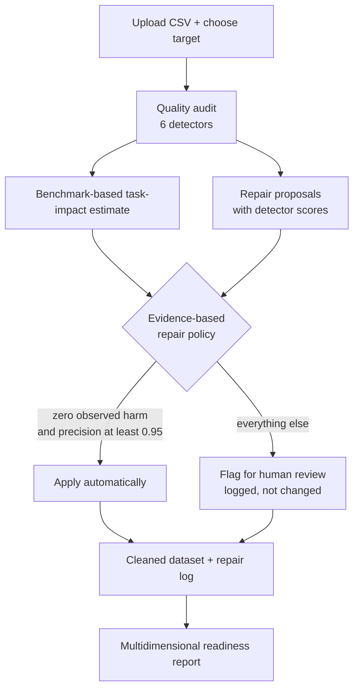
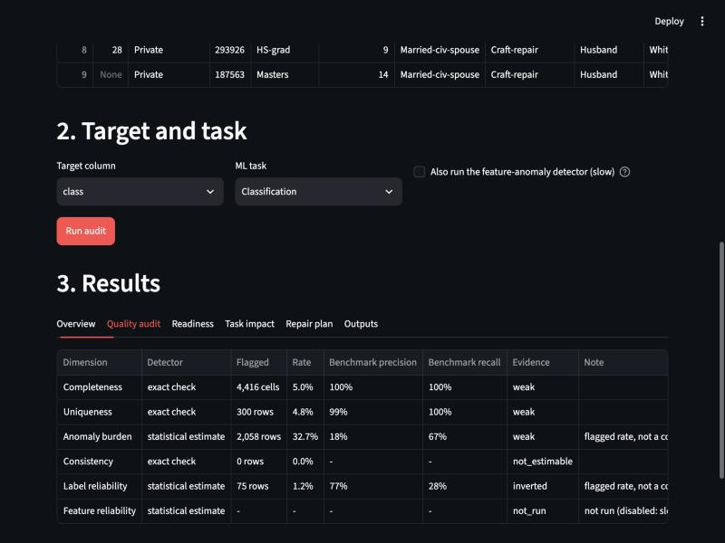
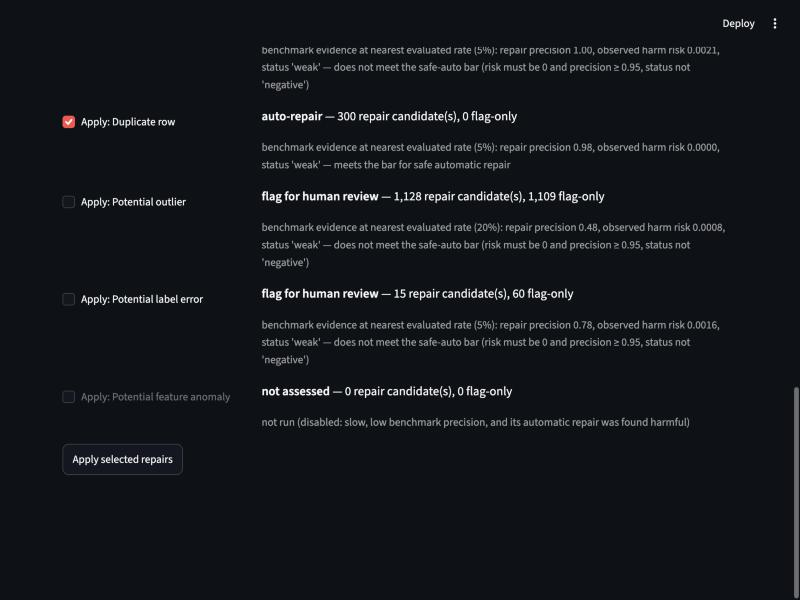
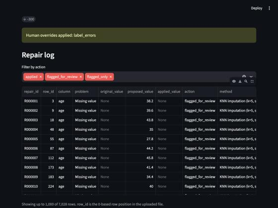
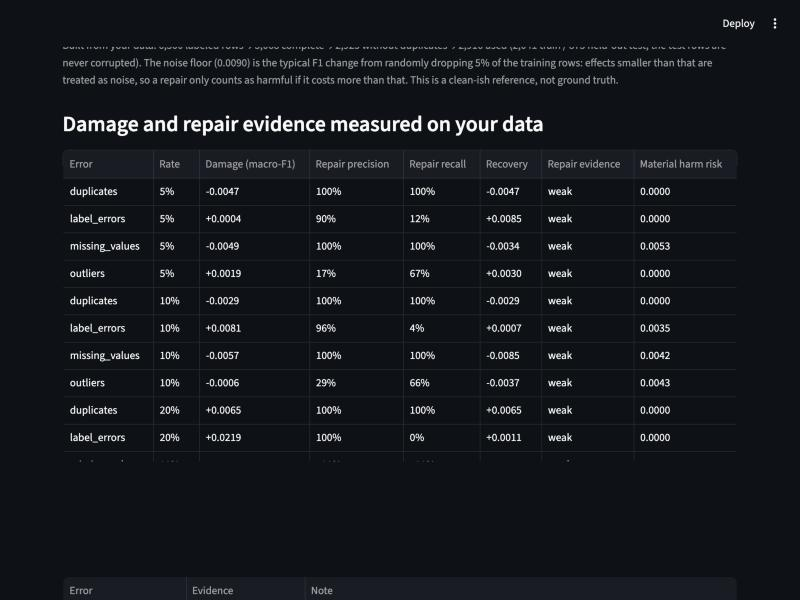

# Task-Aware Data Quality: Impact Analysis and Repair Prioritization for AI-Ready Datasets

**TaskClean** measures how specific data-quality problems actually affect a machine-learning task, decides which
repairs are safe to apply automatically, and reports its confidence honestly, including where a repair makes
things worse.

It is both a **research project** (controlled experiments on UCI Adult, 11 phases) and a **usable tool**
(upload a CSV, get a cleaned dataset, a full repair log, and a multidimensional readiness report).

> **Research question.** Most cleaning pipelines ask *"is this data wrong?"* TaskClean asks *"is this problem
> actually hurting my ML task, can it be repaired safely, and is it worth the effort?"*

---

## Contents

1. [Key ideas](#key-ideas)
2. [How it works](#how-it-works)
3. [The app](#the-app)
4. [Quick start](#quick-start)
5. [Outputs](#outputs)
6. [How the repair policy decides](#how-the-repair-policy-decides)
7. [Research results](#research-results)
8. [Reproducing the experiments](#reproducing-the-experiments)
9. [Project structure](#project-structure)
10. [Limitations](#limitations)
11. [Not done yet](#not-done-yet)

---

## Key ideas

1. **Task-aware impact analysis.** Inject one error type at a time into clean data, retrain, and measure the F1
   loss on an untouched clean test set. Impact is measured, not assumed.
2. **Evidence-based repair, not blanket cleaning.** "Detected" does not mean "safe to repair". A repair is applied
   automatically only if, in the controlled benchmark, it showed zero observed harm and high precision.
3. **Honest uncertainty.** Every dimension carries an *evidence status* (validated / weak / inverted /
   not estimable) separate from its observed rate. No single readiness score is reported, because the evidence
   did not justify one.
4. **Calibration on your own data.** The Adult results do not automatically transfer. Optionally, TaskClean
   re-runs a small version of the experiments on a clean-ish reference built from *your* data and bases its
   decisions on those measurements instead (see [Calibrating on your data](#calibrating-on-your-data)).

## How it works



The research that backs each box was built phase by phase:

```
Phase 1-2   clean baseline on UCI Adult (70/15/15 split, test set never touched)
Phase 3-4   controlled corruption engine + ground-truth log of every changed cell
Phase 5     blind detectors, graded against that ground truth
Phase 6     quality report (flagged rate kept separate from detector reliability)
Phase 7     per-error impact on F1 (5 error types x 3 rates x 5 seeds)
Phase 8     oracle repair: how much performance is theoretically recoverable
Phase 9     real automated repair, graded on repair correctness AND ML recovery
Phase 10    repair prioritization over impact, repairability and risk
Phase 11    AI-readiness: define, validate against ML impact, build the report
```

## The app

| Quality audit | Repair plan | Repair log |
|---|---|---|
|  |  |  |

Detectors are shown with their benchmark precision/recall; each repair type shows the evidence behind its
auto-repair or review decision; every change (and non-change) lands in the repair log.

## Quick start

Developed and tested on Python 3.14, pandas 3.0, scikit-learn 1.9, Streamlit 1.64.

```bash
python3 -m venv .venv && source .venv/bin/activate
pip install -r requirements.txt

streamlit run app.py
```

Use **"Use demo dataset"** in the app for a one-click run (6,300 Adult rows with all five error types injected).

> If your checkout path contains a space, launch with `.venv/bin/python -m streamlit run app.py`;
> the `streamlit` console script's shebang breaks on spaces.

**Command line**

```bash
cd src
python3 taskclean.py ../data/demo_dirty_adult.csv --target class --out ../taskclean_output_demo
```

| Flag | Meaning |
|---|---|
| `--target class` | target column (classification). **Omit it for no-target mode**: missing values, duplicates, outliers and inconsistencies only |
| `--feature-anomalies` | also run the slow feature-anomaly detector (its auto-repair is never recommended) |
| `--apply missing_values,label_errors` | explicit human override of the evidence-based policy |
| `--calibrate` | self-benchmark on your own data and base the policy on it (needs a target; about 20 s to a few minutes) |
| `--calibrate-seeds 3` | seeds per measurement (3 = quick, 5 = steadier) |
| `--max-model-rows 30000` | above this many rows the slow detectors run on a stratified sample |
| `--seed 42` | random seed for the model-based detectors |

**Python**

```python
import sys; sys.path.insert(0, "src")
from taskclean import load_csv, audit_dataset, apply_repairs, write_outputs

df, info = load_csv("my_data.csv")              # detects encoding, delimiter and decimal mark
state = audit_dataset(df, target="churned")     # expensive: detect + propose (target=None for no-target mode)
# optional: replace the Adult evidence with measurements from your own data
# from selfbench import run_self_benchmark; from taskclean import attach_self_benchmark
# attach_self_benchmark(state, run_self_benchmark(state, n_seeds=3))
result = apply_repairs(state)                   # cheap: applies what the evidence approves
write_outputs(result, "out/")
```

`audit_dataset` and `apply_repairs` are separate stages so a UI can change the repair plan without paying for the
model-based audit again.

## Outputs

| File | Contents |
|---|---|
| `dataset_cleaned.csv` | **evidence-based file**: only the repairs the benchmark supports (plus any you override) |
| `repair_log.csv` | every proposed, applied, skipped, and flag-only change for that file: row, column, original, proposed and applied value, method, confidence tier, detector score, evidence status, human-override flag |
| `dataset_cleaned_aggressive.csv` | **aggressive file**: every proposed repair except feature-anomaly repairs (missing values imputed, outliers clipped, high-confidence label flips applied). Model-ready, but most of these repairs did not clear the safety bar |
| `repair_log_aggressive.csv` | the same log for the aggressive file |
| `quality_report.csv` | flagged counts and rates per dimension, with each detector's benchmark precision/recall |
| `impact_report.csv` | benchmark-based task-impact estimate, repair evidence, and the decision per issue |
| `readiness_report.json` / `.csv` | the multidimensional readiness report with evidence status, after-cleaning rates, and limitations |
| `selfbenchmark_evidence.csv` / `selfbenchmark_runs.csv` | (only when calibrated) the evidence table and every individual calibration run |

`row_id` in the log is the 0-based row position in the **uploaded** file. A sample set is in
[`taskclean_output_demo/`](taskclean_output_demo/).

The repair log is the product's proof of what it did. [`src/test_taskclean.py`](src/test_taskclean.py) checks, for
**both** cleaned files, that every cell that differs from the uploaded file is a logged, applied repair, that the
log never claims a repair on a row absent from the output, and that the logged value is what the file contains.
It also checks detection against the injected ground truth on the demo, and runs awkward generic CSVs through the
pipeline (IDs, high-cardinality text, booleans, numbers stored as text, placeholders, unlabeled rows).

## Calibrating on your data

The Adult experiments say what hurts and what is safe to repair *on Adult*. With **Calibrate on this dataset**
(`--calibrate`), TaskClean measures it on your data instead:



1. **Reference.** Build a clean-ish subset of your data: complete rows, no duplicates, high-confidence label
   problems removed (columns that are mostly missing or high-cardinality text are left out). It is the best clean
   data that can be derived, not ground truth.
2. **Experiments.** Split it 70/30. For each error type (missing values, duplicates, outliers, label errors) at
   5/10/20% and several seeds, inject *only* that error into the training rows, train a Random Forest, and measure
   the macro-F1 **damage** against a clean-trained model. Then run the **real TaskClean repair path** on the corrupted
   training data and measure **recovery**, repair precision/recall, and harm. The test rows are never corrupted.
3. **Noise floor.** A null experiment (retrain on a random 90% of the training rows, which should change nothing)
   measures how much F1 moves by chance on *your* data. Effects below it are noise, and a repair only counts as
   harmful if it loses more than that. Small datasets get a larger floor than Adult's 0.003.
4. **Decisions.** The same safe-auto rule runs on your evidence (repair precision of at least 0.95 and no material
   harm). You also get your own damage curves, detector precision/recall, detector false-positive floors, and a
   check of whether each detector's flagged rate tracks real damage on your data.

What it deliberately refuses to do:
- If fewer than 600 clean-ish rows remain, or the target is barely predictable (clean-trained macro-F1 not at least
  0.05 above the same model trained on shuffled labels), it **declines** and the Adult evidence stays in force,
  with the reason reported. "No harm observed" would otherwise be vacuous.
- **Exact restoration is never harm.** When a repair reproduces the clean reference exactly (verified by comparing
  the data, as for duplicate removal), a negative recovery means the corruption happened to help by chance, so it
  cannot count against the repair.
- **Label and feature-anomaly repairs are never applied automatically**, whatever the evidence: label repair
  rewrites the target, and the calibration injects *random* errors while real ones are often structured.

On the Adult demo, calibrating on its own 2,916-row reference (about 20 s) reaches the same decisions as the
five-seed, 32,000-row research: duplicate removal is safe; missing-value imputation, outliers and labels go to review.

## Handling real-world CSVs

| Situation | What TaskClean does |
|---|---|
| Unknown encoding / delimiter / decimal mark | detects UTF-8, cp1252 or Latin-1; `,` `;` tab `|`; decimal comma for `;` files |
| Missing values written as `?`, `N/A`, `-`, `null`, empty text | counted as missing in the analysis; the original cell is shown as-is in the log and left unchanged unless a missing-value repair is applied |
| Numbers stored as text (including `3,5`) | analysed as numeric; imputed values are written back in the same format. Values with leading zeros (ZIP codes) stay text |
| ID columns / high-cardinality text | still checked for missing values and duplicates, skipped by the model-based detectors |
| Rows with no target value | still checked for missing values, duplicates and outliers; excluded from the label and model-based detectors |
| No target column | no-target mode (label check skipped) |
| Very large files | the slow label/feature detectors run on a stratified sample (default limit 30,000 rows); the cheap checks always use every row |
| Continuous or ID-like target | rejected with a clear message (classification only) |

## How the repair policy decides

A repair type is applied **automatically** only if, in the Phase 9 controlled benchmark at the nearest evaluated
corruption rate, all of these hold:

- no seed ever showed net harm (risk = 0),
- repair precision was at least **0.95** (it rarely overwrote legitimate data),
- the repairability status was not *negative*.

On the benchmark evidence this is satisfied by **exact duplicate removal only**, so `dataset_cleaned.csv` changes
little by design. Everything else is logged as a proposal and flagged for human review. If you need a model-ready
file, `dataset_cleaned_aggressive.csv` applies those proposals too (never feature-anomaly repairs) and its log shows
exactly what changed, so you can judge the risk yourself. You can override per issue type in the app, and
overrides are recorded in the log. The 0.95 threshold is a documented policy parameter in
[`src/taskclean.py`](src/taskclean.py) (`SAFE_REPAIR_MIN_PRECISION`).

*"Repair not recommended" means the evaluated strategy was harmful in testing, not that the underlying error is
inherently unrepairable.*

## Research results

All experiments use UCI Adult with a Random Forest (300 trees). The clean baseline is **F1 = 0.680**
(accuracy 0.851, ROC-AUC 0.903); Logistic Regression reaches F1 = 0.662. Corruption rates are 5/10/20%;
experiments use seeds 42-46 and the train/test split is fixed.

### Impact: how much does each error hurt F1? (Phase 7)

Mean F1 damage vs. the clean baseline, mean ± std over 5 seeds:

| Error type | 5% | 10% | 20% |
|---|---|---|---|
| Label errors | 0.0098 ± 0.0054 | 0.0248 ± 0.0032 | **0.0649 ± 0.0105** |
| Feature corruption | 0.0036 ± 0.0042 | 0.0059 ± 0.0018 | 0.0144 ± 0.0063 |
| Outliers | 0.0028 ± 0.0035 | 0.0051 ± 0.0036 | 0.0091 ± 0.0027 |
| Missing values | 0.0042 ± 0.0051 | 0.0006 ± 0.0046 | 0.0071 ± 0.0032 |
| Duplicates | 0.0005 ± 0.0040 | 0.0020 ± 0.0050 | 0.0020 ± 0.0052 |

Label errors dominate. Duplicates' damage is smaller than its own standard deviation, so it is statistically
indistinguishable from zero.

### Detection: can each error be found without ground truth? (Phase 5)

| Error type | Unit | Precision | Recall |
|---|---|---|---|
| Missing values | rows | 1.00 | 1.00 |
| Duplicates | rows | 0.99 | 1.00 |
| Label errors | rows | 0.77 | 0.28 |
| Outliers | cells | 0.18 | 0.67 |
| Feature anomalies | cells | 0.28 | 0.26 |

Grading is cell-level where corruption is cell-level (an earlier row-level grading inflated the feature-anomaly
score from 0.26 to 0.67). Outlier precision is low partly because `capital-gain` is top-coded in the real census data,
so injected extremes are indistinguishable from legitimate ones.

### Repair: does automatic repair help? (Phase 9, mean over 5 seeds)

| Error type | Rate | ML recovery (ΔF1) | Repair precision | Repair recall |
|---|---|---|---|---|
| Duplicates | 10% | +0.0032 | 0.99 | 1.00 |
| Missing values | 10% | -0.0003 | 1.00 | 1.00 |
| Label errors | 10% | +0.0031 | 0.86 | 0.06 |
| Outliers | 10% | +0.0017 | 0.31 | 0.57 |
| **Feature corruption** | 10% | **-0.0071** | 0.33 | 0.12 |

- **Detected is not safe to repair.** Feature-corruption repair is net-harmful at every rate: most of what it
  "fixes" was never corrupted, and the substitutes are worse than the original data.
- **The most damaging error is the hardest to repair automatically.** Label-error repair is precise but its
  recall is 0.01-0.18 under the conservative policy, so it recovers almost none of the damage.
- Missing-value imputation turns net-harmful at 20% (ΔF1 = -0.0054).
- Recovery ratios (recovery ÷ damage) are not reported for duplicates/outliers/missing: numerator and denominator
  are both near the noise floor, so the ratio is unstable.

### Prioritization (Phase 10)

`Priority = w_impact·Impact − w_risk·Risk + w_repair·Repairability`, each min-max normalised within a corruption
rate. Headline at 10% with equal weights: **label errors (0.66) > duplicates (0.35) > outliers (0.31) > missing
values (0.16) > feature corruption (-0.26)**.

Across a grid of 15 weight combinations at 10%, label errors rank first and feature corruption last in **100%** of
them. That robustness is **severity-dependent**: at 5% label errors rank first in 53% of combinations, and at 20%
missing-value repair turns harmful and competes with feature corruption for last place.

### AI-readiness (Phase 11)

No single readiness score is reported. Across 15 (error type, rate) points the pooled correlation between
*detected rate* and *measured damage* was **r = -0.24 (p = 0.39)**, and detector baselines sit on incomparable scales.

| Error type | r (detected rate vs. damage) | Reading |
|---|---|---|
| Outliers | 0.99 | tracks damage |
| Feature corruption | 0.95 | tracks damage, high false-positive floor (~46% flagged on clean data) |
| Duplicates | 0.78 | tracks damage |
| Missing values | 0.61 | weak / inconclusive |
| **Label errors** | **-0.95** | **inverted** |

The label-error detector's flagged rate *falls* as true corruption (and real damage) rises, most likely because its
cross-validated model is degraded by the label noise it is auditing. A low flagged label-error rate must therefore
not be read as reassurance. Each correlation rests on 3 rates, so it is directional evidence, not significance.

The product therefore reports a multidimensional readiness table (observed rate, false-positive floor, evidence
status, status, after-cleaning rate) instead of one number. Impact figures are labelled **benchmark-based
task-impact estimates**; for observed rates beyond the validated 0-20% range they are **boundary estimates**.

## Reproducing the experiments

Run from `src/`. Adult is fetched via OpenML on first use (copies are in `data/`).

| Phase | Command | Notes |
|---|---|---|
| 2 | `python3 baseline.py` | clean baselines |
| 3-4 | `python3 phase3_4_test.py` | writes `results/corruption_log.csv` |
| 5 | `python3 phase5_test.py` | several minutes (cross-feature detector) |
| 6 | `python3 quality_report.py` | several minutes |
| 7 | `python3 phase7_impact.py --full` | omit `--full` for a quick single-seed run |
| 8 | `python3 phase8_oracle_repair.py --full` | |
| 9 | `python3 phase9_repair_engine.py --full` | long-running (tens of minutes) |
| 10 | `python3 phase10_prioritization.py` | aggregation only, seconds |
| 11 | `python3 phase11_readiness.py` | validation, several minutes |
| 11 | `python3 phase11c_report_demo.py` | renders the readiness report |
| product | `python3 test_taskclean.py` | end-to-end invariants |
| calibration | `python3 test_selfbench.py` | about a minute |

Every model fit is recorded in [`results/training_log.csv`](results/training_log.csv) (timestamp, duration, model,
hyperparameters, dataset shape, seed). Random Forest has no epochs; the log records fits, not per-epoch loss.
The `*_full.csv` files in `results/` are the authoritative 5-seed results; `*_single_seed.csv` are validation runs.

## Project structure

```
app.py                         Streamlit front end
src/
  taskclean.py                 product layer: audit -> policy -> repair -> reports (also a CLI)
  selfbench.py                 calibration: measures impact, repair effectiveness and harm on the uploaded data
  test_taskclean.py            end-to-end invariants and generic-CSV robustness
  test_selfbench.py            calibration tests (rules match the Adult Phase 10 table; declines when it should)
  data.py  baseline.py         Phase 1-2: data, split, clean baselines
  corruption/                  Phase 3-4: error injection with ground-truth logs
  detect.py                    Phase 5: detectors
  quality_report.py            Phase 6
  phase7_impact.py             Phase 7
  phase8_oracle_repair.py      Phase 8
  phase9_repair_engine.py      Phase 9
  phase10_prioritization.py    Phase 10
  phase11_readiness.py         Phase 11 (+ phase11c_report_demo.py)
  training_log.py              provenance log of every model fit
  make_demo_dataset.py         builds data/demo_dirty_adult.csv
  errors.py train.py impact.py repair.py readiness.py pipeline.py
                               superseded v1 prototype (breast-cancer data); not used by the current pipeline
data/                          Adult (original + clean) and the demo dataset with its corruption log
results/                       raw and summary CSVs for every experiment
taskclean_output_demo/         sample outputs of the product on the demo dataset
docs/screenshots/              app screenshots
```

## Limitations

- **Estimate-based audit.** On an uploaded dataset the true errors are unknown; every rate comes from a detector
  with the precision/recall limits above. A flagged rate is not a confirmed error rate.
- **Benchmark transfer.** Without calibration, impact estimates and repair evidence come from Adult + Random Forest
  and do not transfer automatically to another dataset or model. Calibration measures them on your data, but with a
  Random Forest, macro-F1, a few seeds, and a clean-ish reference rather than true ground truth: undetected problems
  left in the reference and selection bias from dropping incomplete rows can make damage look smaller or repairs
  easier. It injects random errors, so measured repair precision can be optimistic for structured real-world errors.
- **False-positive floors** for the statistical detectors come from clean Adult data unless you calibrate (then they
  come from your reference), so "Attention / Good" is indicative only without calibration.
- **Small validation sample.** Detector-vs-damage correlations use 3 corruption rates per error type.
- **No before/after model metrics for uploads.** An uploaded dataset has no clean held-out test set, and evaluating
  on a slice of the same dirty data would mislead.
- **Placeholders.** A token such as `-` or `N/A` that is a genuine category in your data is over-counted as missing.
- **Sampling.** On files above the row limit, label/feature findings and proposals cover only the sampled rows.
- **Scope.** Classification targets only (up to 20 classes), or no target at all. Duplicates are full-record duplicates (features +
  target). Inconsistent-value detection is report-only because no repair evidence exists for it. The
  feature-anomaly detector is off by default (slow, low precision, harmful repair).
- **No composite score.** The tested aggregate of detected rates was not supported by the evidence; this does not
  prove no composite could ever work.

## Not done yet

- Logistic Regression validation of the Random Forest findings.
- A second dataset (e.g. Heart Disease) to test whether the prioritization transfers.
- Calibration of feature-anomaly repair (it stays on the Adult evidence and is never applied automatically).
- Validating calibration against more datasets than Adult and synthetic data.

## Data

UCI Adult (Census Income), loaded through OpenML (`fetch_openml("adult", version=2)`). The demo dataset is a
6,000-row sample with all five error types injected at 5%, generated by `src/make_demo_dataset.py`.
